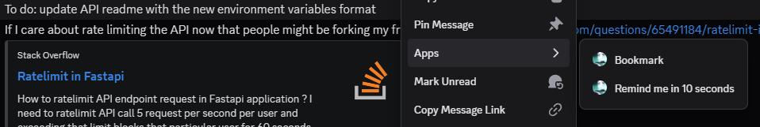
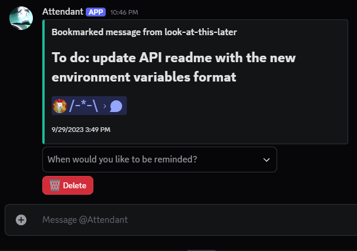
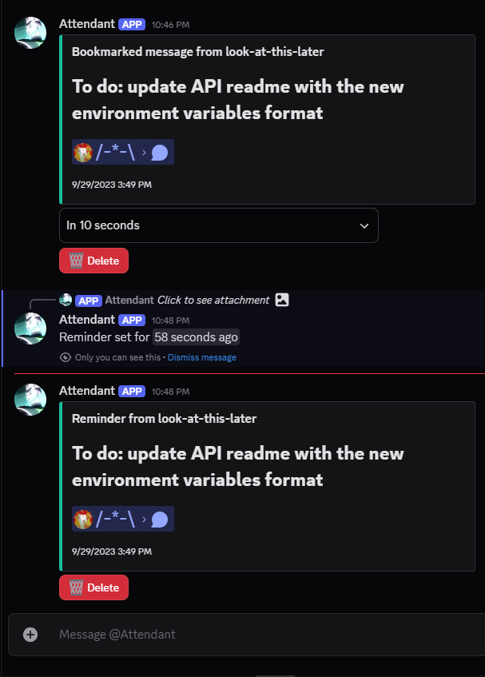
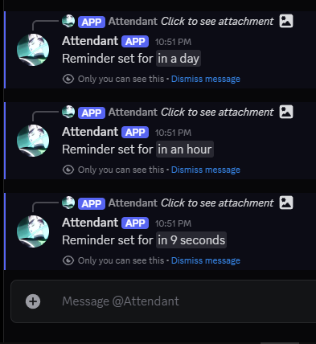

# discord-bookmarks-and-reminders-bot

A Discord bot designed to remind users (i.e. me) about specific messages at some future time.

This slightly grew in scope from solely a reminder system (i.e. 'send me a link to this message in 1 hour') to a combined bookmarks and reminders system (i.e. 'save a link to this message in a list at which I can look and for which I can set reminders whenever I want') for a few reasons, one of which being having bookmarks enabled the provision of more options for reminder-wait-times.

Uses a sqlite file (`data.db`) in the application directory to store the reminders and bookmarks.

## Running the application

Made with rustc version `1.87.0` (or something like that) but most recent development has been in `1.89.0`.

### Environment variables

The application reads some environment variables at runtime:

```env
DISCORD_TOKEN = ... # The token for the Discord bot account
TEST_GUILD_ID = ... # The ID of a Discord server for which commands should be re-registered on every start-up of the application. Not required
```

### Running

Given [Cargo](https://doc.rust-lang.org/stable/cargo/) is installed:

```sh
cargo run -r [-- --reregister]
```

When provided the `--reregister` flag, the application re-registers all commands globally.
Last I checked, there was a rate limit to the daily amount of command registrations (which I hit by continuously registering commands every time I ran the app during development), so this behavior is gated behind this flag to help prevent hitting that limit.
(I don't think this flag will be needed outside of development.)

## Interacting with the Discord bot

The `/help` command provides a list of commands with brief descriptions. I describe in more detail some basic behavior below:

### Setting reminders

Given the bot has been added to your user / to a server to which you belong (and also given that the bot is online):

Right-click a message the bot can see
(if you've added the bot to your user, then I believe this means any DM (individual or group) you can see; or, if the bot is in a server, then this means any server channel it can see)
and access the Apps context menu.

From here, select the "Remind me in 10 seconds" option to be reminded via DM in 10 seconds (not super useful beyond testing the feature), or select "Bookmark" to receive
a direct message from the bot with a drop-down menu offering various reminder time options.

Each non-ephemeral message from the bot comes with a Delete message in case you're interested in clearing up the chat history.

#### Context menu



#### Example bookmark



#### Example reminder

Example reminder after having selected "Remind me in 10 seconds" in the drop-down:

(Screenshot taken 58 seconds after receiving the reminder)



#### Various reminder time selections

